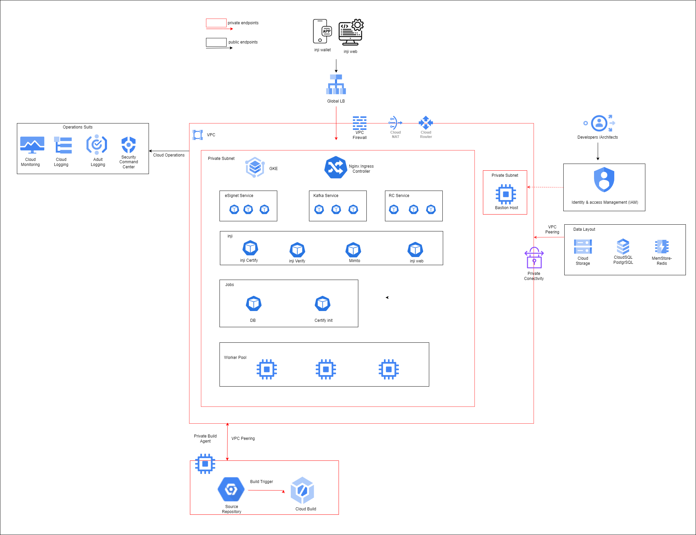

# INJI, one-click deployment on Azure



## Introduction

## Deployment Approach

Deployment uses the following tools:

- **Terraform for Azure** - Infrastructure deployment
- **Helm chart** - Application/Microservices deployment


The entire Terraform deployment is divided into 2 stages -

- **Pre-Config** stage
    - Create the required infra for deployment
- **Setup** Stage
    - Deploy the Core services

### Helm Chart Details
#### INJI
Currently, the below release version of the Helm charts will be deployed. The version can be updated in the [.env](.env) file if needed.

| Chart                      | Chart Version | Docker Image                 | Docker Version |
|----------------------------|---------------|------------------------------|----------------|
| mosip/inji-certify         | 0.9.0         | mosipid/inji-certify         | 0.9.0          |
| mosip/mimoto               | 0.13.1        | tejashjl/mimoto              | develop        |
| mosip/injiweb              | 0.9.0         | mosipdev/inji-web            | develop        |
| mosip/injiverify           | 0.9.0         | mosipqa/inji-verify          | latest         |

#### eSignet
Currently, the below release version of the Helm charts will be deployed. The version can be updated in the [deployments/.esignet.env](deployments/.esignet.env) file if needed.

| Chart                      | Chart Version | Docker Image                 | Docker Version       |
|----------------------------|---------------|------------------------------|----------------------|
| mosip/softhsm              | 12.0.1        | mosipid/softhsm              | v2                   |
| mosip/artifactory          | 12.0.1        | tejashjl/artifactory-server  | develop              |
| mosip/keycloak             | 7.1.18        | mosipid/mosip-keycloak       | 16.1.1-debian-10-r85 |
| mosip/postgres-init        | 12.0.1        | mosipid/postgres-init        | 1.2.0.1              |
| mosip/esignet              | 1.4.1         | mosipid/esignet              | 1.4.0                |
| mosip/oidc-ui              | 1.4.1         | mosipid/oidc-ui              | 1.4.0                |
| mosip/keycloak-init        | 12.0.1        | mosipid/keycloak-init        | 1.2.0.1              |
| mosip/mock-identity-system | 0.9.3         | mosipid/mock-identity-system | 0.9.3                |


#### RC
Currently, the below release version of the Helm charts will be deployed. The version can be updated in the [deployments/.registry.env](deployments/.registry.env) file if needed.

| Service                   | Docker Version |
|---------------------------|----------------|
| registry                  | v1.0.0         |
| credential_schema_service | v2.0.0-rc3     |
| credentials_service       | v2.0.0-rc3     |
| keycloak_service          | v1.0.0         |
| identity_service_version  | v2.0.0-rc3     |


### Pre-requisites

- #### [Install the azure CLI](https://learn.microsoft.com/en-us/cli/azure/install-azure-cli)

- #### [Install terraform](https://developer.hashicorp.com/terraform/tutorials/aws-get-started/install-cli)

- #### Azure account and subscription id

### Workspace - Folder structure

- **(***Root Folder***)**
    - **assets**
        - images
        - architetcure diagrams
        - ...(more)
    - **deployments -** Store config files required for deployment
        - **configs**
            - Store config files required for deployment
        - **scripts**
            - Shell scripts required to deploy services
    - **terraform-scripts**
        - Deployment files for end to end Infrastructure deployment
    


## Step-by-Step guide for INJI deployment

### Infrastructure Deployment

#### Terraform State management
Pre-requisites:
- Subscription ID

```bash
cd terraform-scripts/storage-state
terraform init
terraform plan  -var="subscription_id=***" 
terraform apply  -var="subscription_id=***" 
```

#### Terraform infra
Pre-requisites:
- Subscription ID
- SSH public key

```bash
cd terraform-scripts/infra
terraform init
terraform plan -var="subscription_id=***" -var="bastion_admin_password=admin@123" -var="ssh_public_key=ssh***"
terraform apply -var="subscription_id=***" -var="bastion_admin_password=admin@123" -var="ssh_public_key=ssh***"
```

Output
```bash
Apply complete! Resources: 1 added, 1 changed, 0 destroyed.

Outputs:

lb_ip = "20.44.100.211"
resource_group_name = "inji-rg-dev"
```

After infra deployment, you would need to point 4 domains/sub-domain to the above LoadBalancer IP
Domains:
1. FR Domain - Ex: (demofr.domain.com)
2. eSignet Domain - Ex: (demoesignet.domain.com)
3. Inji Domain - Ex: (demoinji.domain.com)
4. Inji Verify Domain - Ex: (demoverify.domain.com)

### INJI service deployment

#### Connect to bastion host
Update the private ssh key path and subscription id in below command
```bash
az network bastion ssh --name "bastion-dev" --resource-group "inji-rg-dev" --target-resource-id "/subscriptions/**subscription_id**/resourceGroups/inji-rg-dev/providers/Microsoft.Compute/virtualMachines/bastion-vm-dev" --auth-type "ssh-key" --ssh-key "~/.ssh/id_ed25519" --username adminuser
```
Install az cli and login
```bash
curl -sL https://aka.ms/InstallAzureCLIDeb | sudo bash

az login
```

Run the below script to deploy INJI services
```bash
curl -sL https://raw.githubusercontent.com/tejash-jl/azure-devops/refs/heads/main/inji_setup.sh | bash -s -- 
```