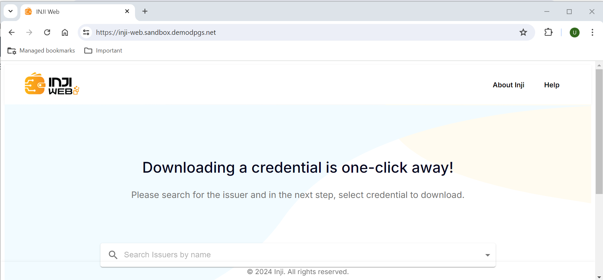

## AWS CDK One Click Deployment ##

### CDK Stack Overview
The CDK comprises stacks designed to perform unique provisioning steps, making the overall automation modular.

  1. CDK Stacks provisioning AWS Resources
  2. CDK Stacks provisioning HELM execution charts
  3. CDK Configuration files

#### 1. CDK Stacks provisioning AWS Resources
Designed and implemented Infrastructure as Code (IaC) using AWS CDK to automate and consistently provision AWS resources. The table below lists the stacks and their corresponding default provisioned AWS resources.

| CDK Stack   name   | File name/path   | Description                                                                                       | Default AWS Resources                                                                                                                                  |
|--------------------|------------------|---------------------------------------------------------------------------------------------------|--------------------------------------------------------------------------------------------------------------------------------------------------------|
| vpcstackinji    | lib/vpc-stack.ts     | Foundation stack creation including VPC,   Subnets, Route   tables, Internet Gateway, NAT Gateway | One VPC with 4 subnets, divided into 2 public subnets, 2   private subnets across two availability zones.                      |
| eksec2stackinji | lib/eks-ec2-stack.ts | Creates EKS EC2 Cluster                                                                           | An Amazon EKS cluster   provisioned with on-demand EC2 instances of the t2.medium instance class. All   EC2 instances are deployed in private subnets. |


#### 2. CDK Stacks provisioning HELM execution charts
Helm charts were implemented using AWS CDK to automate and consistently deploy INJI services. The table below lists the stacks and their corresponding EKS pod names.

| CDK   Stack name                 | File name/path                     | Description                                                                                                                                                                                | Pods Deployed                                              |
|----------------------------------|------------------------------------|--------------------------------------------------------------------------------------------------------------------------------------------------------------------------------------------|------------------------------------------------------------|
 | mimotohelmStackinji      | lib/mimoto-helm-stack.ts      | Deploys mimoto service.                                                                                                      | mimoto |
 | injiwebhelmStackinji      | lib/inji-web-helm-stack.ts      | Deploys Inji Web app                                                                                                      | inji-web |
 | injiverifyhelmStackinji      | lib/inji-verify-helm-stack.ts      | Deploys Inji Verify app                                                                                                      | inji-verify |

 ### Prerequisties:

Before deploying CDK stacks, ensure you have the following prerequisites in place:

1. [AWS CLI](https://docs.aws.amazon.com/cli/latest/userguide/getting-started-install.html)
2. [Node.js](https://nodejs.org/en/download/package-manager)
3. [OpenSSL](https://openssl-library.org/source/index.html)
4. Access to AWS account

### Prepare your environment
```
# Install TypeScript globally for CDK
npm i -g typescript

# Install aws cdk
npm i -g aws-cdk

# Clone the repository
git clone <repo_url>
cd inji-aws-automation

# Install the CDK application
npm i

# cdk bootstrap [aws://<ACCOUNT-NUMBER>/<REGION>]
cdk bootstrap aws://<ACCOUNT-NUMBER>/<REGION>
```

#### Update mandatory environment variables, with your preferred editor. Open '.env' file in the CDK app.

| ENVIRONMENT   VARIABLES | EXAMPLE VALUE                                                                       | DESCRIPTION                                                                                                                                                                                                                                               |
|-------------------------|-------------------------------------------------------------------------------------|-----------------------------------------------------------------------------------------------------------------------------------------------------------------------------------------------------------------------------------------------------------|
| REGION                  | ap-south-1                                                                          | AWS region                                                                                                                                                                                                                                                |
| ACCOUNT                 | 1234567890                                                                          | AWS 12 digit account number                                                                                                                                                                                                                               |
| CIDR                    | 10.20.0.0/16                                                                        | VPC CIDR, change it as per your environment                                                                                                                                                                                                               |
| MAX_AZS                 | 2                                                                                   | AWS Availability Zone count, default 2                                                                                                                                                                                                                    |
| EKS_CLUSTER_NAME        | ekscluster-inji                                                                  | AWS EKS Cluster name                                                                                                                                                                                                                                      |
| DOMAIN                  | sandbox.demodpgs.net                                                                | Domain name which will be used by inji and keycloak services                                                                                                                                                                                           |
| CERTIFICATE_ARN         | XXX  | Amazon certificate ARN for the domain used. It helps to enable the HTTPS   for the domain endpoint                                                                                                                                                        |
| LOADBALANCER_NAME       | inji-alb                                                                         | Amazon Application Load balancer name for inji web and inji verify. Both the   services uses the same loadbalancer and routes the application through  granular rules. It is also possible to use different loadbalancer name by   configuring config.ts file |

**Deploy CDK**
```
# After updating the .env file, run AWS CDK commands to begin with deploy

# Emits the synthesized CloudFormation template
cdk synth

# List CDK stack
cdk list

# Deploy single stack  - vpcstackinji, eksec2stackinji, injiverifyhelmStackinji
# The stack 'injiverifyhelmStackinji' will also install mimotohelmStackinji and injiwebhelmStackinji in the prescribed order.
cdk deploy <stack_name>

# Alternatively you could also deploy all stacks and CDK would handle the sequence
cdk deploy --all 
```

After installing all the CDK stacks, verify the AWS services in the AWS web console. It is recommended to review the [Deployment through Helm](02-Deployment-Helm-INJI.md) guide to become familiar with Helm charts, services, and parameters. This will be beneficial if you opt to run the Helm chart separately from the CDK, following the "Mode Two: Direct Helm Chart Invocation" approach for installing the INJI stack.

# Post Installation Steps

Please verify that the URLs and settings align with your specific deployment and requirements. Enjoy leveraging INJI for your project and begin utilizing both the INJI web and INJI verify.

- INJI_WEB_DOMAIN_NAME & INJI_VERIFY_DOMAIN_NAME are the subdomain names for INJI configured in config.ts file. These domain names are configured in Amazon Route 53.

- Inji Web portal will be accessible at **https://<INJI_WEB_DOMAIN_NAME>/**



- Inji Verify portal will be accessible at **https://<INJI_VERIFY_DOMAIN_NAME>/**


**Lastly, if you wish to clean up, run 'AWS CDK destroy' to remove all AWS resources that were created by it.**
```
cdk destroy [STACKS..]
```
