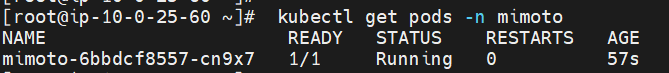
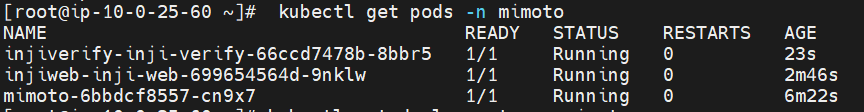
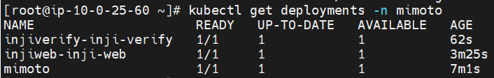
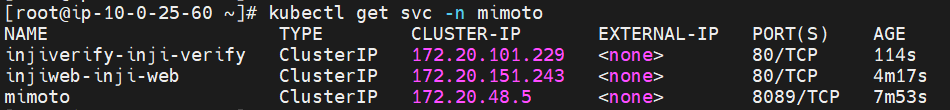
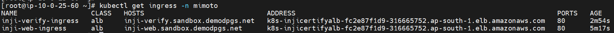

# INJI Helm Chart Deployment

The INJI Helm chart deployment provides an efficient way to deploy INJI and its associated services in your existing AWS environment. This means you don’t need to use AWS CDK to provision the base services such as VPC and Amazon EKS, among others. See the prerequisite section below for more details.

# Prerequisites

Before deploying these Helm charts, ensure you have the following prerequisites in place:

1. [Git Client](https://git-scm.com/)
2. [OpenSSL](https://openssl-library.org/source/index.html)
3. [Helm](https://helm.sh/) (installed on your local machine)
4. [Kubectl](https://kubernetes.io/docs/tasks/tools/install-kubectl/) (installed on your local machine)
5. Amazon EKS Cluster

## Deploying INJI services

#### 1. Initialize INJI Helm Repository

```
helm repo add inji-aws <INJI_HELM_CHARTS_URL>
```

#### 2. Check the Helm Repo Status:

```
helm repo list
```

```
NAME                    URL
inji-aws             <INJI_HELM_CHARTS_URL>
```
```
helm search repo inji-aws
```

```
NAME                          CHART VERSION   APP VERSION  DESCRIPTION
inji-aws/mimoto                0.1.0          1.16.0       A Helm chart for Kubernetes
inji-aws/inji-web              0.1.0          1.16.0       A Helm chart for Kubernetes
inji-aws/inji-verify           0.1.0          1.16.0       A Helm chart for Kubernetes
```
#### 4. Install mimoto :

| Property Name                | Value            | Description                              |
|------------------------------|------------------|------------------------------------------|
| config.mimotoConfigUrl       | mimoto-issuers-config.json | Configuration file to integrate eSignet and SunbirdRC                   |
| config.credentialTemplateUrl | CredentialTemplate.html    | HTML template file which will be used for any schema use case                        |
| config.keyFileUrl            | client-identity.p12        | esignet key pair file created as p12 format   |

NOTE: This example uses S3 bucket with public access to store and retrive all above files.
```
helm upgrade --install <mimoto_release_name> inji-aws/mimoto -n mimoto --create-namespace \
--set config.mimotoConfigUrl="https://inji-resources-xdesgser.s3.ap-south-1.amazonaws.com/mimoto-issuers-config.json" \
--set config.credentialTemplateUrl="https://inji-resources-xdesgser.s3.ap-south-1.amazonaws.com/CredentialTemplate.html" \
--set config.keyFileUrl="https://inji-resources-xdesgser.s3.ap-south-1.amazonaws.com/client-identity.p12"
```
Verify the services that have been deployed using below commands.

```
kubectl get pods -n mimoto
```



#### 5. Install INJI Web:
```
helm upgrade --install <inji-web_release_name> inji-aws/inji-web -n mimoto --create-namespace
```
```
kubectl get pods -n mimoto
```


#### 6. Install INJI Verify:
```
helm upgrade --install <inji-verify_release_name> inji-aws/inji-verify -n mimoto --create-namespace
```
```
kubectl get pods -n mimoto
```



#### 9. After deployment, access the services and components as required.

Ensure all pods are running and check the service status in your specified namespace.

```
kubectl get deployments -n mimoto
```


```
kubectl get svc -n mimoto
```


Retrieve the Amazon Application Load Balancer (ALB) DNS name by executing the commands below. 

```bash
kubectl get ingress -n mimoto
```


After running this command, you should see the ALB DNS name. Use this DNS name to access the INJI web and INJI verify.

# Post Installation Steps

Please verify that the URLs and settings align with your specific deployment and requirements. Enjoy leveraging INJI for your project and begin utilizing both the INJI web and INJI verify.

- INJI_WEB_DOMAIN_NAME & INJI_VERIFY_DOMAIN_NAME are the subdomain names for INJI configured in inji-web and inji-verify helm charts. These domain names are configured in Amazon Route 53.

- Inji Web portal will be accessible at **https://<INJI_WEB_DOMAIN_NAME>/**


- Inji Verify portal will be accessible at **https://<INJI_VERIFY_DOMAIN_NAME>/**


**Lastly, if you wish to clean up, run below two commands to remove all resources that were created by you.**
```
helm uninstall <release_name> -n <namespace>

kubectl delete ns <namespace>
```

