# Sunbird RC and eSignet Helm Chart Deployment

The Sunbird RC and eSignet Helm chart deployment provides an efficient way to deploy Sunbird RC, eSignet and its associated services in your existing AWS environment. This means you don’t need to use AWS CDK to provision the base services such as VPC, Amazon RDS, and Amazon EKS, among others. See the prerequisite section below for more details.

# Prerequisites

Before deploying these Helm charts, ensure you have the following prerequisites in place:

1. [Git Client](https://git-scm.com/)
2. [pgAdmin](https://www.pgadmin.org/download/pgadmin-4-windows/) (Optional: This PostgreSQL client is used to verify the DB changes. You could install it on your EC2 instance in the VPC with access to Amazon RDS Postgres server)
3. [Helm](https://helm.sh/) (installed on your local machine)
4. [Kubectl](https://kubernetes.io/docs/tasks/tools/install-kubectl/) (installed on your local machine)
5. Amazon EKS Cluster
6. Amazon RDS PostgreSQL
7. Amazon S3 bucket with public access

## Initialize helm repository

```bash
helm repo add inji-certify-aws <INJI_CERTIFY_HELM_CHARTS_URL>
helm repo add mosip https://mosip.github.io/mosip-helm
```

## Check the helm repo status

```bash
helm repo list
```

```bash
NAME                    URL
inji-certify-aws        <INJI_CERTIFY_HELM_CHARTS_URL>
mosip                   https://mosip.github.io/mosip-helm

```
```bash
helm search repo inji-certify-aws
```
```bash
NAME                                        CHART VERSION   APP VERSION  DESCRIPTION
inji-certify-aws/artifactory                12.0.2                        A Helm chart for MOSIP Artifactory
inji-certify-aws/esignet                    1.4.0                         A Helm chart for MOSIP esignet module
inji-certify-aws/esignet-init               0.1.0           1.16.0        A Helm chart for Kubernetes
inji-certify-aws/esignet-preinit            0.1.0           1.16.0        A Helm chart for Kubernetes
inji-certify-aws/keycloak                   7.1.18          16.1.1        Keycloak is a high performance Java-based identity platform
inji-certify-aws/oidc-ui                    1.4.0                         A Helm chart for MOSIP OIDC UI module
inji-certify-aws/sunbird-c-charts           0.0.1           0.0.13        A Helm chart for Sunbird RC
inji-certify-aws/sunbird-r-charts           0.0.1           0.0.13        A Helm chart for Sunbird RC
inji-certify-aws/sunbird_rc_charts          0.0.1           0.0.13        A Helm chart for Sunbird RC
inji-certify-aws/vault-init                 0.1.0           1.16.0        A Helm chart for Kubernetes

```
```bash
helm search repo mosip
```
```
NAME                          CHART VERSION   APP VERSION  DESCRIPTION
mosip/kafka                 18.3.1          3.2.1         Apache Kafka is a distributed streaming platform
mosip/kafka-ui              0.4.2           v0.4.0        A Helm chart for kafka-UI
mosip/keycloak-init         12.0.1          1.2.0         A Helm chart for Kubernetes to initialize Keycloak
mosip/postgres-init         12.0.1          1.2.0         A Helm chart for Kubernetes to initialize various database
mosip/softhsm               12.0.1                        A Helm chart for MOSIP Softhsm module
```

## Deploying Sunbird RC services
#### 1. Install vault from HashiCorp
Create a file named helm-vault-raft-values.yml and copy below content.

```bash
global:
  enabled: true
  namespace: "sbrc"
server:
  affinity: ""
  ha:
    enabled: false
    raft:
      enabled: false
      setNodeId: true
      config: |
        cluster_name = "vault-integrated-storage"
        storage "raft" {
            path    = "/vault/data/"
        }
        listener "tcp" {
           address = "[::]:8200"
           cluster_address = "[::]:8201"
           tls_disable = "true"
        }
        service_registration "kubernetes" {}
```
```bash
helm install <vault_release_name> HashiCorp/vault \
--version 0.24.0 \
--values helm-vault-raft-values.yml \
-n sbrc --create-namespace
```
Wait until vault pod in Running state. Vault pod will not be in ready state until it is initialized and unsealed.


#### 2. Initialize vault using vault-init chart
```bash
helm upgrade --install <vault_init_release_name> vault-init/ -n sbrc \
--set envVars.NAMESPACE="sbrc" \
--set envVars.VAULT_NAME="<vault_release_name>"
```

Ensure vault pod is in Ready state. Init will takes 1-2 minutes to  make vault pod is in ready state


#### 3. Install Sunbird RC 
 | Property Name                                    | Value   | Description                         |
   | ---------------------------------------------  | ------- | ----------------------------------- |
   | global.alb.name                            | incertify-alb  | AWS ALB name. Please mention the name you used in .env file in LOADBALANCER_NAME               |
   | global.alb.certificateArn         | XXXXYY  | AWS Certificate ARN for the domain                |
   | global.alb.registryHost           | registry.sandbox.demodpgs.net  | Subdomain for registry service             |
   | global.alb.credentialHost         | credentials.sandbox.demodpgs.net  | Subdomain for credentials service               |
   | global.alb.schemaHost             | schema.sandbox.demodpgs.net  | Subdomain for schema service               |
   | global.alb.identityHost           | identity.sandbox.demodpgs.net  | Subdomain for identity service              |
   | global.alb.health                 | /health  | health check endpoint to be configured Amazon ALB               |
   | global.database.host              | XXXXYY  | RDS/Data Host Address               |
   | global.database.user              | XXXXYY  | RDS/Data Username                   |
   | global.registry.database                        | XXXXYY  | RDS/Data Database                   |
   | global.registry.signature_provider              | dev.sunbirdrc.registry.service.impl.SignatureV2ServiceImpl  | This value is set to tell the Sunbird RC that it uses registryAndCredentialling           |   
   | global.secrets.DB_PASSWORD                     | XXXXYY  | Database Password in Base64 encoded format                 |  
   | global.secrets.DB_URL                          | XXXXYY  | postgres://${rdsuser}:${RDS_PASSWORD}@${rdsHost}:5432/${credentialDBName} in Base64 encoded  format         |
   | global.vault.address                            | XXXXYY  | http://<vault_release_name>:8200   |
   | global.vault.base_url                           | XXXXYY |http://<vault_release_name>:8200/v1     |
   | global.vault.root_path                          | XXXXYY  |http://<vault_release_name>:8200/v1/kv  |

   ```bash
helm upgrade --install <release_name> sunbird-c-charts/ -n <namespace> --create-namespace  \
--set global.alb.name="inji-ceritfy-alb"
--set global.alb.certificateArn="arn:aws:acm:ap-south-1:1234567890:certificate/6064b56f-1367-4dc4-9a42-290bd724479a"
--set global.alb.registryHost="registry.sandbox.demodpgs.net"
--set global.alb.credentialHost="credential.sandbox.demodpgs.net"
--set global.alb.schemaHost="schema.sandbox.demodpgs.net"
--set global.alb.identityHost="identity.sandbox.demodpgs.net"
--set global.alb.health="/health"
--set global.database.host="<YOUR_DB_HOST_ADDRESS>" \
--set global.database.user="postgres" \
--set global.registry.database="registry" \
--set global.registry.signature_provider="dev.sunbirdrc.registry.service.impl.SignatureV2ServiceImpl" \
--set global.secrets.DB_PASSWORD="TkxoTCpJLWU1NGU=" \
--set global.secrets.DB_URL="cG9zdGdyZXM6Ly9wb3N0Z3JlczpOTGhMKkktZTU0ZUByZHNzdGFja3NicmMyLWRhdGFiYXNlYjI2OWQ4YmItYjkyanl5bXdhdzZoLmNsdXN0ZXItY3Zla2xpdDJyajRtLmFwLXNvdXRoLTEucmRzLmFtYXpwewqdsavbmF3cy5jb206NTQzMi9zdW5iaXJ" \
--set global.vault.address="http://<VAULT_RELEASE_NAME>:8200" \
--set global.vault.base_url="http://<VAULT_RELEASE_NAME>:8200/v1" \
--set global.vault.root_path="http://<VAULT_RELEASE_NAME>:8200/v1/kv" \

```

```bash
watch -n .5 kubectl get pods -n sbrc
```
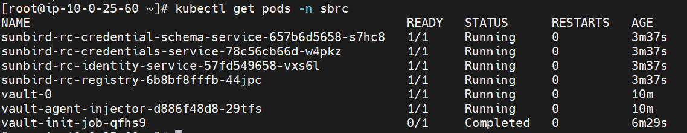

#### 4. After deployment, access the services and components as required.
Ensure all pods are running except registry pod and check the service status in your specified namespace.

```bash
kubectl get deployments -n sbrc
```
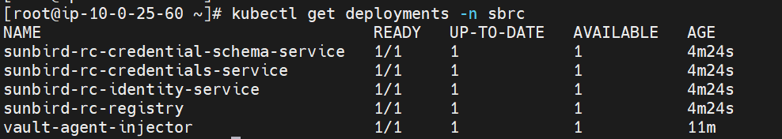

```bash
kubectl get svc -n sbrc
```


* NOTE:
If Vault becomes sealed, you have the option to unseal it using the unseal token stored in Kubernetes secrets.

```bash
kubectl get secrets vault-unseal-key -n sbrc
```
Unseal the vault pods using below command.

```bash
kubectl exec <vault_pod_name> -n sbrc -- vault operator unseal <vault_unseal_key>
```

## Deploying eSignet services
#### 1. Prerequisites configurations for eSignet

Complete the Sunbird RC post installations and obtain the values from it. Visit this [link](03-Post-Installation-Procedure.md#sunbird-rc-post-installation)

#### 2. Install eSignet bootstrap:
eSignet bootstrap helm chart creates the database in RDS Postgres instance for both esignet and keycloak services. It also creates global configmap and db secrets in esignet kubernetes namespace which is mandatory for esignet core service.

| Property Name          | Value            | Description                                      |
|------------------------|------------------|--------------------------------------------------|
| image.envVars.HOST     | YYYYYYYY         | RDS/Data Host Address                            |
| image.envVars.USERNAME | postgres         | RDS/Data Username                                |
| image.envVars.PASSWORD | XXXXXXXX         | RDS/Data password                                |
| image.envVars.NEW_DB   | esignet_keycloak | RDS/Data Database                                |
| dbPassword             | XWXADDWAD=AWQ    | base64 encoded value of RDS/Data password        |
| domain.enabled         | true             | if this value is true, you must provide domain details in below variables, Otherwise, provide same ALB DNS name in all below variables.
| domain.name            | sandbox.demodpgs.net  | Root domain name for entire esignet applications. If you dont have custom domain, please leave it empty |
| domain.mosipApiHost    | api  | creates config as api.sandbox.demodpgs.net |
| domain.mosipMinioHost    | minio  | creates config as minio.sandbox.demodpgs.net |
| domain.mosipApiInternalHost | api-internal | creates config as api-internal.sandbox.demodpgs.net |
| domain.mosipIamExternalHost | iamesignet  | creates config as iamesignet.sandbox.demodpgs.net |
| domain.mosipEsignetHost| oidc  | creates config as oidc.sandbox.demodpgs.net |

```bash
helm upgrade --install <esignet_bootstrap_release_name> inji-certify-aws/esignet-bootstrap -n esignet --create-namespace \
--set image.envVars.HOST="YYYYYYYY" \
--set image.envVars.USERNAME="postgres" \
--set image.envVars.PASSWORD="XXXXXXXX" \
--set image.envVars.NEW_DB="esignet_keycloak" \
--set dbPassword="XWXADDWAD=AWQ" \
--set domain.enabled=true \
--set domain.name="sandbox.demodpgs.net" \
--set domain.mosipApiHost="api" \
--set domain.mosipApiInternalHost="api-internal" \
--set domain.mosipMinioHost="minio" \
--set domain.mosipIamExternalHost="iamesignet" \
--set domain.mosipEsignetHost="oidc"
```
Verify the services that have been deployed using below commands.

```bash
kubectl get pods -n esignet
```


```bash
kubectl get configmap -n esignet
```
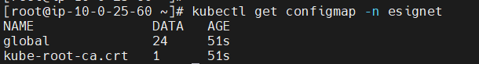

```bash
kubectl get secrets -n esignet
```


#### 3. Install eSignet dependent services:
eSignet dependent services are installed as specific HELM charts such as artifactory, softhsm, kafka, kafka-UI and keycloak.

##### 3.1 Artifactory
```bash
helm upgrade --install <artifactory_release_name> inji-certify-aws/artifactory -n artifactory --create-namespace
```
```bash
kubectl get pods -n artifactory
```
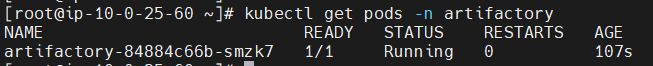

##### 3.2 Softhsm
```bash
helm upgrade --install <softhsm_release_name> mosip/softhsm -n softhsm --create-namespace
```
```bash
kubectl get pods -n softhsm
```
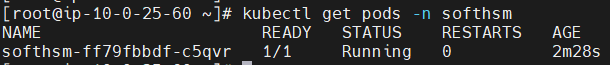

##### 3.3 Kafka & Kafka UI
```bash
helm upgrade --install <kafka_release_name> mosip/kafka -n kafka --create-namespace
helm upgrade --install <kafka_ui_release_name> mosip/kafka-ui -n kafka
```
```bash
kubectl get pods -n kafka
```
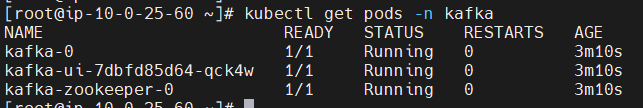

##### 3.4 Keycloak
| Property Name             | Value               | Description                                      |
|---------------------------|---------------------|--------------------------------------------------|
| alb.enabled               | TRUE                | Creates AWS load balancer if the field is 'true' |
| alb.name                  | esignet-alb         | AWS ALB name. Please mention the name you used in .env file in LOADBALANCER_NAME.                                  |
| alb.host                  | iam.sandbox.demodpgs.net | (Optional) Sub domain for keycloak service                  |
| alb.path                  | /auth               | Routing path for keycloak service                |
| alb.certificateArn        | ZZZZZZZZZZZ         | AWS Certificate ARN for the domain               |
| externalDatabase.host     | YYYYYYYY            | RDS/Data Host Address                            |
| externalDatabase.port     | 5432                | RDS/Data port number                             |
| externalDatabase.user     | postgres            | RDS/Data Username                                |
| externalDatabase.database | esignet_keycloak    | RDS/Data Database                                |
| externalDatabase.password | XXXXXXXX            | RDS/Data password                                |

```bash
helm upgrade --install <keycloak_release_name> inji-certify-aws/keycloak -n keycloak --create-namespace \
--set alb.enabled="true" \
--set alb.name="esignet-alb" \
--set alb.host="iam.sandbox.demodpgs.net" \
--set alb.path="/auth"  \
--set alb.certificateArn="arn:aws:acm:ap-south-1:1234567890:certificate/6064b56f-1367-4dc4-9a42-290bd724479a"  \
--set externalDatabase.host="YYYYYYYY" \
--set externalDatabase.port=5432 \
--set externalDatabase.user="postgres" \
--set externalDatabase.database="esignet_keycloak" \
--set externalDatabase.password="XXXXXXXX"
```

```bash
kubectl get pods -n keycloak
```
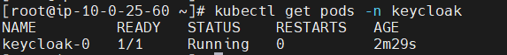

#### 4. Install eSignet initializations:
eSignet initializations are for executing some scripts to do specific task for dependent and esignet core service to ensure the seamless configurations.

##### 4.1 Postgres Init:
| Property Name                   | Value    | Description           |
|---------------------------------|----------|-----------------------|
| dbUserPasswords.dbuserPassword  | XXXXXXXX | RDS/Data password     |
| databases.mosip_esignet.enabled | TRUE     |                       |
| databases.mosip_esignet.host | YYYYYYYY | RDS/Data Host Address |
| databases.mosip_esignet.port    | 5432     | RDS/Data port number  |

```bash
helm upgrade --install <postgres_init_release_name> mosip/postgres-init -n esignet \
--set dbUserPasswords.dbuserPassword="XXXXXXXX"  \
--set databases.mosip_esignet.enabled="true" \
--set databases.mosip_esignet.host="YYYYYYYY" \
--set databases.mosip_esignet.port=5432
```

```bash
kubectl get pods -n esignet
```
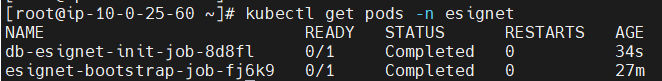

##### 4.2 Keycloak Init:
```bash
helm upgrade --install <keycloak_init_release_name> mosip/keycloak-init -n keycloak
```

```bash
kubectl get pods -n keycloak
```
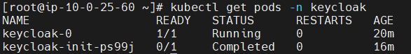

##### 4.3 eSignet Init:
| Property Name               | Value                                                 | Description           |
|-----------------------------|-------------------------------------------------------|-----------------------|
| image.envVars.DB_HOSTNAME   | YYYYYYYY                                              | RDS/Data Host Address |
| image.envVars.DB_USERNAME   | postgres                                              | RDS/Data Username     |
| image.envVars.DB_PASSWORD   | XXXXXXXX                                              | RDS/Data password     |
| image.envVars.DB_PORT       | 5432                                                  |                       |
| image.envVars.AWS_KAFKA_ARN | kafka-0.kafka-headless.${kafka.profile}:${kafka.port} | Kafka endpoint        |
| image.envVars.SBRC_RELEASE   | sbrc                                              | Mention the helm release name used in above Sunbird RC helm chart |
| image.envVars.SBRC_NAMESPACE   | sbrc                                              | Mention the kubernetes namespace name used in above Sunbird RC helm chart |
| image.envVars.SBRC_DID   | did:web:abc.s3.ap-south-1.amazonaws.com::be7d6347-f607-42e8-a10f-2248d6765b30   | DID number generated in sunbird RC post installation step. [link](03-Post-Installation-Procedure.md#sunbird-rc-post-installation) |
| image.envVars.SBRC_SCHEMA_ID   | did:schema:6cc36213-5705-4896-9cec-7b881765e4bc    | Credential schema id generated in sunbird RC post installation step. [link](03-Post-Installation-Procedure.md#sunbird-rc-post-installation) |

```bash
helm upgrade --install <esignet_init_release_name> inji-certify-aws/esignet-init -n esignet \
--set image.envVars.DB_HOSTNAME="YYYYYYYY" \
--set image.envVars.DB_USERNAME="postgres" \
--set image.envVars.DB_PASSWORD="XXXXXXXX" \
--set image.envVars.DB_PORT="5432" \
--set image.envVars.AWS_KAFKA_ARN="kafka-0.kafka-headless.${kafka.profile}:${kafka.port}"
--set image.envVars.SBRC_RELEASE="sbrc" \
--set image.envVars.SBRC_NAMESPACE="sbrc" \
--set image.envVars.SBRC_DID="did:web:abc.s3.ap-south-1.amazonaws.com::be7d6347-f607-42e8-a10f-2248d6765b30" \
--set image.envVars.SBRC_SCHEMA_ID="did:schema:6cc36213-5705-4896-9cec-7b881765e4bc" \
```

   ```bash
   kubectl get pods -n esignet
   ```
   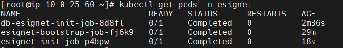

#### 5. Install eSignet core services:
```bash
   helm upgrade --install <esignet_release_name> inji-certify-aws/esignet -n esignet
   ```
  
   ```bash
   kubectl get pods -n esignet
   ```
   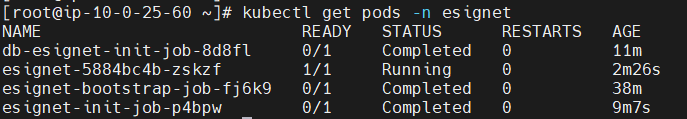

#### 6. Install OIDC UI:
| Property Name      | Value                   | Description                                      |
|--------------------|-------------------------|--------------------------------------------------|
| alb.enabled        | TRUE                    | Creates AWS load balancer if the field is 'true' |
| alb.name           | esignet-alb             | AWS ALB name. Please mention the name you used in .env file in LOADBALANCER_NAME                                   |
| alb.host           | esignet.sandbox.demodpgs.net | (Optional) Sub domain for esignet service                   |
| alb.path           | /                       | Routing path for esignet service                 |
| alb.certificateArn | ZZZZZZZZZZZZZZZ         | AWS Certificate ARN for the domain               |

```bash
helm upgrade --install <oidc_ui_release_name> inji-certify-aws/oidc-ui -n esignet \
--set alb.enabled="true" \
--set alb.name="esignet-alb" \
--set alb.host="esignet.sandbox.demodpgs.net" \
--set alb.path="/" \
--set alb.certificateArn="arn:aws:acm:ap-south-1:1234567890:certificate/6064b56f-1367-4dc4-9a42-290bd724479a"
```

   ```bash
   kubectl get pods -n esignet
   ```
   

#### 7. After deployment, access the services and components as required.

Ensure all pods are running and check the service status in your specified namespace.

```bash
kubectl get pods -A --field-selector metadata.namespace!=kube-system
```
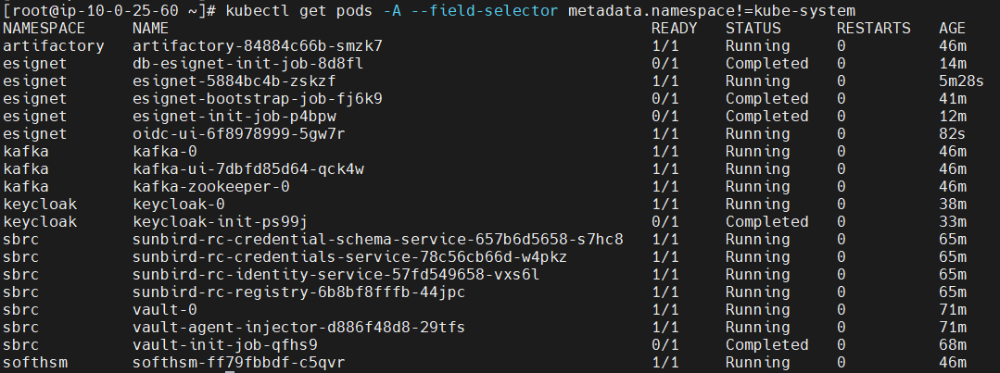

```bash
kubectl get deployments -A --field-selector metadata.namespace!=kube-system
```


```bash
kubectl get svc -n esignet
```


Retrieve the Amazon Application Load Balancer (ALB) DNS name by executing the commands below. 

```bash
kubectl get ingress -n esignet
```


```bash
kubectl get ingress -n keycloak
```


After running this command, you should see the ALB DNS name. Use this DNS name to access the Keycloak and OIDC portal.

Follow the post installation steps to start using eSignet services

* [Post Installation Procedure](03-Post-Installation-Procedure.md#esignet-post-installation)

**Lastly, if you wish to clean up, run below two commands to remove all resources that were created by you.**
```bash
helm uninstall <release_name> -n <namespace>

kubectl delete ns <namespace>
```
