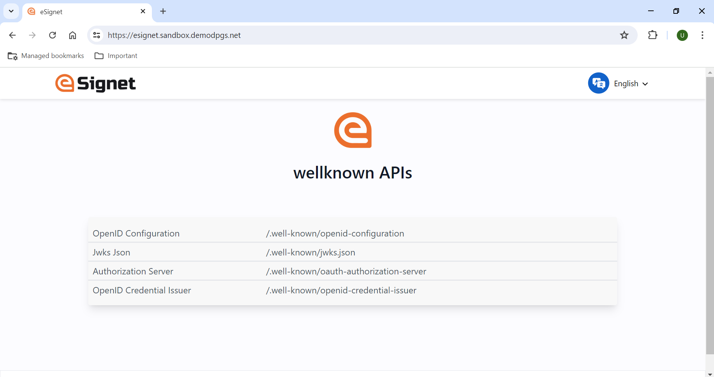

# Post Installation Steps
Please verify that the URLs and settings align with your specific deployment and requirements. Begin utilizing both the sunbird rc and esignet.

# Sunbird RC Post Installation

1. Sunbird RC uses AWS Route53 domain configuration for registry, identity, credentials-service and credential-schema services. Sub domain is mapped based on the below ingress.These domain names are configured in Amazon Route 53. If you have your own DNS management system, you can configure it there.


2. Post Sunbird domain configuration, proceed to create an issuer and credential schema. Refer to the Postman collections available [here](https://github.com/Sunbird-RC/demo-mosip-rc/blob/main/Demo%20Mosip%20RC.postman_collection.json).
    * Set the hostname of the endpoints in the postman environments.
    * For generating a DID use the `Generate a DID` API:
      * Change the `method` field in request body to `web` and `services` to an empty list
      * Take note of the `id` field from the API response.
      * Open S3 bucket created in the CDK stack, create a folder with the name of the unique id from the `id` field.
      * Example: If the `id` from the response is `did:web:challabeehyv.github.io:DID-Resolve:3313e611-d08a-49c8-b478-7f55eafe62f2` then the folder name should be `3313e611-d08a-49c8-b478-7f55eafe62f2`
      *  Create a file named did.json in the above folder and add the response from `Generate a DID` API.
      * Enable Public access to the did.json in S3 bucket.
      * Similarly multiple DIDs can be hosted in a single S3 bucket with different folder names.
    * Now create a credential schema and create an issuance registry
         * take note of `$.schema[0].author`  and  `$.schema[0].id` from the create credential schema request

3. Update .env file in the CDK app and pass the values from the above steps.
    * SBRC_RELEASE =  "sunbird-rc"
    * SBRC_NAMESPACE = "sbrc"
    * SBRC_DID = "did:web:challabeehyv.github.io:DID-Resolve:3313e611-d08a-49c8-b478-7f55eafe62f2"
    * SBRC_SCHEMA_ID = `$.schema[0].id`
4. Run eSignet CDK stack or eSignet helm charts in specified sequence order.

# eSignet Post Installation

Please verify that the URLs and settings align with your specific deployment and requirements. Enjoy leveraging eSignet for your project and begin utilizing both the eSignet UI and API.

- KEYCLOAK_DOMAIN and ESIGNET_DOMAIN are the DNS configured .env file or manual helm charts.
These domain names are configured in Amazon Route 53. If you have your own DNS management system, you can configure it there.

- Keycloak portal will be accessible at **https://<KEYCLOAK_DOMAIN>/auth**


- eSignet API portal will be accessible at **https://<ESIGNET_DOMAIN>/v1/esignet/swagger-ui.html**


- eSignet UI portal will be accessible at **https://<ESIGNET_DOMAIN>/**



With this, the deployment of eSignet on AWS has been successfully completed.

## eSignet Integration with INJI:
This README provides instructions for configuring esignet with INJI to verify the esignet flow. In order to use eSignet service, you need to create OIDC client. OIDC client creates the client id, public & private key pair for the INJI app to use eSignet.

### 1. Create OIDC client

Follow the below steps to create OIDC client in postman.

1. Download the postman collection and environment for sunbird use case from [here](https://github.com/mosip/digital-credential-plugins/tree/master/sunbird-rc-esignet-integration-impl/postman-collections).

2. Import the downloaded collection and environment into postman.

3. To create an OIDC/OAuth client, run the below request from the postman collection "OIDC Client mgmt" folder
   * Get CSRF token
   * Create OIDC Client
4. A Client ID will be generated and it will be used in mimoto-configuration.
5. Take the private key (in JWK format) from postman environment and generate  the client-identity.p12 file using below sequence of commands
```
 Generate pem file from private key using this link https://8gwifi.org/jwkconvertfunctions.jsp and save pem data as key.pem
 
 openssl req -new -sha256 -key key.pem -out csr.csr
 
 openssl req -x509 -sha256 -days 365 -key key.pem -in csr.csr -out certificate.pem

 openssl pkcs12 -export -out client-identity.p12 -inkey key.pem -in certificate.pem --name mpartner-default-mimotooidc
 
 upload client-identity.p12 file into S3 bucket/any other storage with public access.
```
6. The following details that are generated from the above steps will be passed to mimoto-issuers-config.json to complete the integraton between esignet and mimoto
   - Client ID
   - client-identity.p12
   - esignet domain name
   - "mpartner-default-mimotooidc" client alias name
7. Go to INJI-AWS-Automation and complete the prerequisites using the above values and enjoy using Sunbird RC, eSignet integration with INJI.

